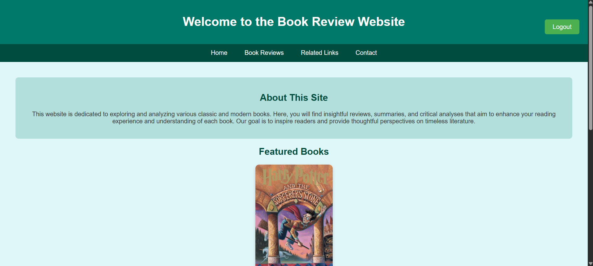
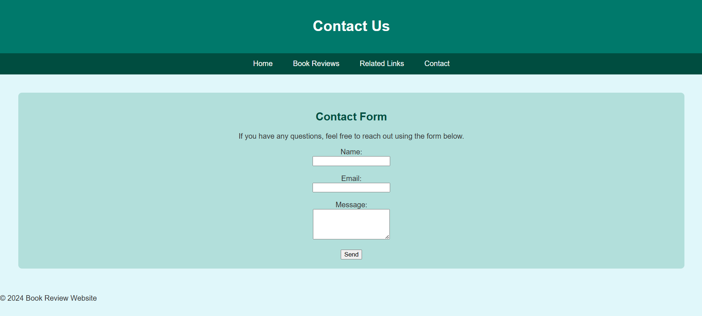
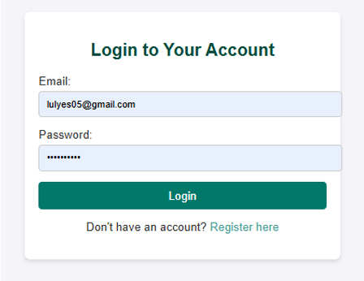

#  Thoughtful Reads — Book Review Website

A dynamic and interactive book review website developed as part of the Internet Technologies course (2nd year, 2024/2025). Built with HTML, CSS, PHP, JavaScript, and MySQL.

---

## Live Demo
[thoughtfulreads.cba.pl](https://thoughtfulreads.cba.pl/) *(hosting expired)*

---

## Features

-  Book gallery with lightbox image viewer
-  CSS hover and transition effects on book covers
-  Related links page with 10 external book resources
-  Visitor counter
-  Random quote display from classic literature
-  Genre-based poll with dynamic book recommendations
-  Submit and browse book reviews
-  Contact form with server-side message storage and JavaScript validation
-  User registration and login system
-  Scroll-to-top button
-  Responsive design with media queries (mobile-friendly)
-  SEO optimization (meta tags, XML sitemap, robots.txt, Google Analytics)
-  HTML & CSS validated with no errors

---

##  Technologies Used

| Layer     | Technology              |
|-----------|-------------------------|
| Frontend  | HTML5, CSS3, JavaScript |
| Backend   | PHP 8.2                 |
| Database  | MySQL via phpMyAdmin    |
| Local Dev | XAMPP                   |

---

##  Database Structure

- **`users`** — stores registered user accounts
- **`reviews`** — stores book reviews submitted by users
- **`messages`** — stores contact form submissions

---

##  Screenshots

### Home Page

### Book Reviews

### Contact Page

### Login & Register

---

## Local Setup

1. Install [XAMPP](https://www.apachefriends.org/)
2. Clone the repository into `C:/xampp/htdocs/`
3. Open [phpMyAdmin](http://localhost/phpmyadmin) and create the database
4. Update `config.php` with your local database credentials
5. Start **Apache** and **MySQL** in XAMPP Control Panel
6. Visit `http://localhost/book-review-website` in your browser

---

## SEO Implementation

- Descriptive `<title>` tags on every page
- Meta charset and viewport tags on all pages
- Semantic HTML elements (`<header>`, `<main>`, `<section>`, `<footer>`)
- Descriptive `alt` attributes on all images
- Accessible forms with `<label>` elements
- XML sitemap submitted to Google Search Console
- `robots.txt` configured to block `/admin/`
- Google Analytics integrated for traffic monitoring

---

## Developer

**Eylul Ates**  
Computer Engineering  
Faculty of Electrical Engineering, Automatic Control and Informatics  
2024/2025
